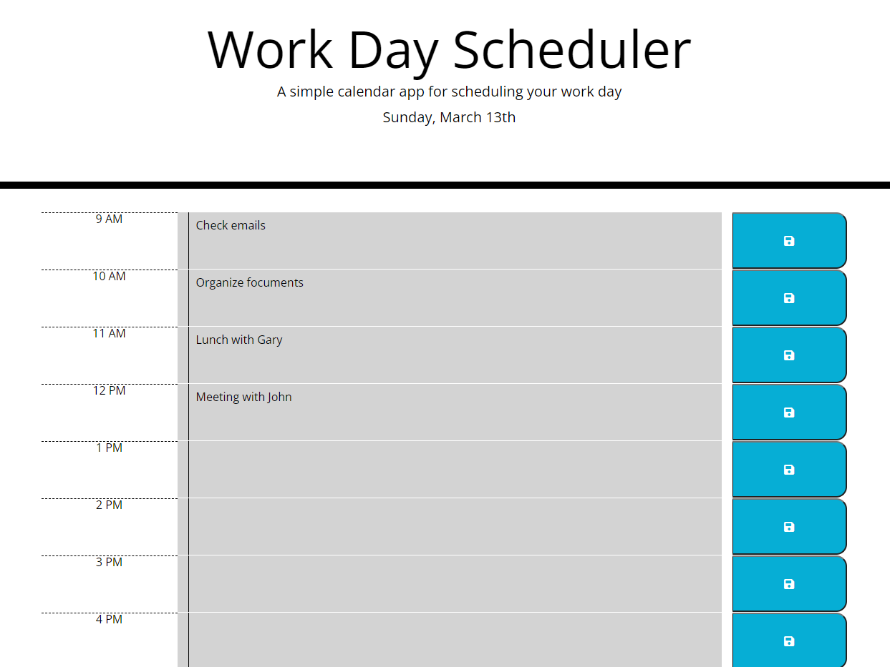

# Work Day Scheduler

- a simple calendar application that allows a user to save events for each hour of the day.

- built using MomentJS, JQuery, and Bootstrap.

[Link to app](https://nvsco-10.github.io/work-day-scheduler/)

 

## Features

- Current date is displayed using MomentJS.

- Time blocks are color coded to indicate whether it is in the past(gray), present(red), or future(green).

- When a user clicks on the save button, entries are saved using local storage and when page is refreshed, the saved entries will be displayed.

 

  

## License 

This code is licensed under the MIT License.

## Contributions

--------------

